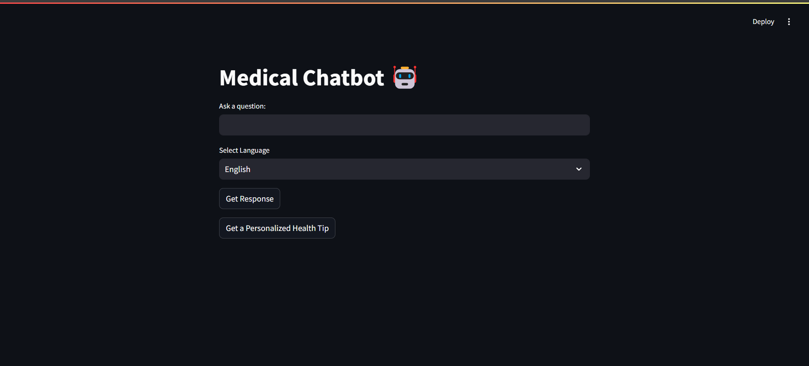
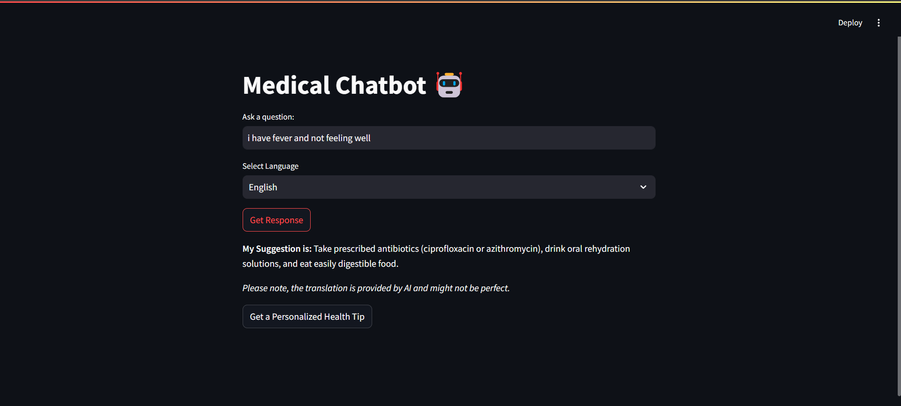
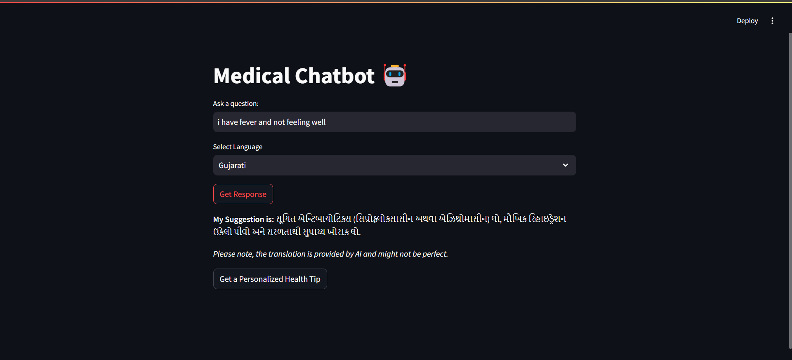

# 🩺 AI Health Assistant

An intelligent, multilingual medical chatbot built with **Streamlit** that provides symptom-based suggestions, possible remedies, and personalized health tips.

> ⚠️ **Disclaimer:** This application is for informational purposes only and does not replace professional medical advice.

---

## 🚀 Overview

AI Health Assistant allows users to input symptoms or health-related queries and receive relevant guidance using **semantic similarity matching** powered by SentenceTransformers.

### Key Capabilities:

* Matches user queries with a medical dataset
* Provides the most relevant remedy or suggestion
* Falls back to keyword-based responses if confidence is low
* Generates personalized wellness tips
* Supports multiple languages for accessibility

---

## ✨ Features

* 🔍 **Semantic Search** using SentenceTransformers
* 💡 **Personalized Health Tips** (stress, sleep, fatigue, etc.)
* 🌍 **Multilingual Support** via Google Translate
* 🖥️ **Interactive UI** built with Streamlit
* ⚠️ **Safe Fallback Mechanism** for low-confidence predictions
* 📁 **Portable Dataset Handling** (relative paths)

---

## 🛠️ Tech Stack

* Python
* Streamlit
* Pandas
* SentenceTransformers
* Hugging Face Transformers
* PyTorch
* Googletrans

---

## 📂 Project Structure

```
AI-Health-Assistant/
│── chat.py
│── dataset - Sheet1.csv
│── requirements.txt
│── README.md
└── images/
```

---

## ⚙️ Installation

### 1️⃣ Clone the Repository

```
git clone https://github.com/adibshaikh0313/AI-Health-Assistant.git
cd AI-Health-Assistant
```

### 2️⃣ Create Virtual Environment (Recommended)

```
python -m venv venv
```

Activate:

* **Windows**

```
venv\Scripts\activate
```

* **Linux / Mac**

```
source venv/bin/activate
```

---

### 3️⃣ Install Dependencies

```
pip install -r requirements.txt
```

---

### 4️⃣ Run the Application

```
streamlit run chat.py
```

---

## ⚙️ How It Works

1. User enters a symptom or query
2. Input is converted into embeddings
3. Compared with dataset using semantic similarity
4. Best match is returned as a remedy
5. If confidence is low:

   * Keyword-based fallback is used
   * General safety advice is shown
6. Response is optionally translated

---

## 🌐 Supported Languages

* English
* Hindi
* Gujarati
* Tamil
* Telugu
* Urdu
* Arabic
* Chinese
* Japanese
* Korean
* German
* French
* Turkish

---

## 📸 Screenshots

### Main Screen



### Language Dropdown


### Suggestions in English



### Suggestions in Gujarati



### Health Tips


---

## ⚠️ Important Notes

* This chatbot **does not provide medical diagnosis**
* Always consult a **qualified healthcare professional**
* Translation may occasionally fail and fall back to original text

---

## 🚀 Future Improvements

* 🧠 Larger and more accurate medical dataset
* 💬 Chat history tracking
* 📊 Improved ranking algorithm
* 🔐 More reliable translation APIs
* 📢 UI-based medical disclaimer banner

---

## 🙌 Acknowledgments

* Streamlit – Web app framework
* SentenceTransformers – Semantic similarity
* Hugging Face – Model ecosystem
* Googletrans – Translation support

---

## 👨‍💻 Author

**Pranav Shah**

---

## 📄 License

This project is licensed under the **MIT License**.

---
